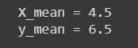
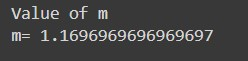
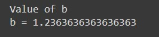
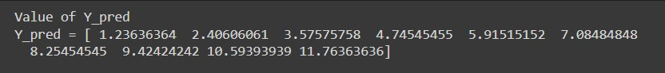
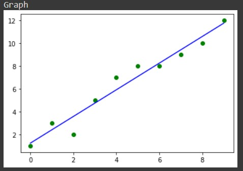

#  Implementation of Univariate Linear Regression
# Aim:
To implement univariate Linear Regression to fit a straight line using least squares.

# Equipments Required:
1. Hardware – PCs
2. Anaconda – Python 3.7 Installation / Jupyter notebook

# Algorithm:
1. Get the independent variable X and dependent variable Y.
2. Calculate the mean of the X -values and the mean of the Y -values.
3. Find the slope m of the line of best fit using the formula. 

4. Compute the y -intercept of the line by using the formula:

5. Use the slope m and the y -intercept to form the equation of the line.
6. Obtain the straight line equation Y=mX+b and plot the scatterplot.

# Program:


Program to implement univariate Linear Regression to fit a straight line using least squares.

Developed by: YUVARAJ V

RegisterNumber: 212220220056


```
import pandas as pd
import numpy as np
import matplotlib.pyplot as plt

X=np.array([0,1,2,3,4,5,6,7,8,9])
Y=np.array([1,3,2,5,7,8,8,9,10,12])

X_mean=np.mean(X)
print("X_mean =",X_mean)
Y_mean=np.mean(Y)
print("y_mean =",Y_mean)

num=0
denum=0

for i in range(len(X)):
  num+=(X[i]-X_mean)*(Y[i]-Y_mean)
  denum+=(X[i]-X_mean)**2

# To Find m
print("Value of m")
m=num/denum
print("m=",m)

# To Find b
print("Value of b")
b=(Y_mean)-(m*X_mean)
print("b =",b)

# To Find Y_pred
print("Value of Y_pred")
Y_pred=m*X+b
print("Y_pred =",Y_pred)

plt.scatter(X,Y,color='green')
plt.plot(X,Y_pred,color='blue')
print("Graph")
plt.show()
```
# Output:
## Mean Values:

## Value of m:

## Value of b:

## Value of Y_pred:

## Graph:


# Result:
Thus the univariate Linear Regression was implemented to fit a straight line using least squares using python programming.
